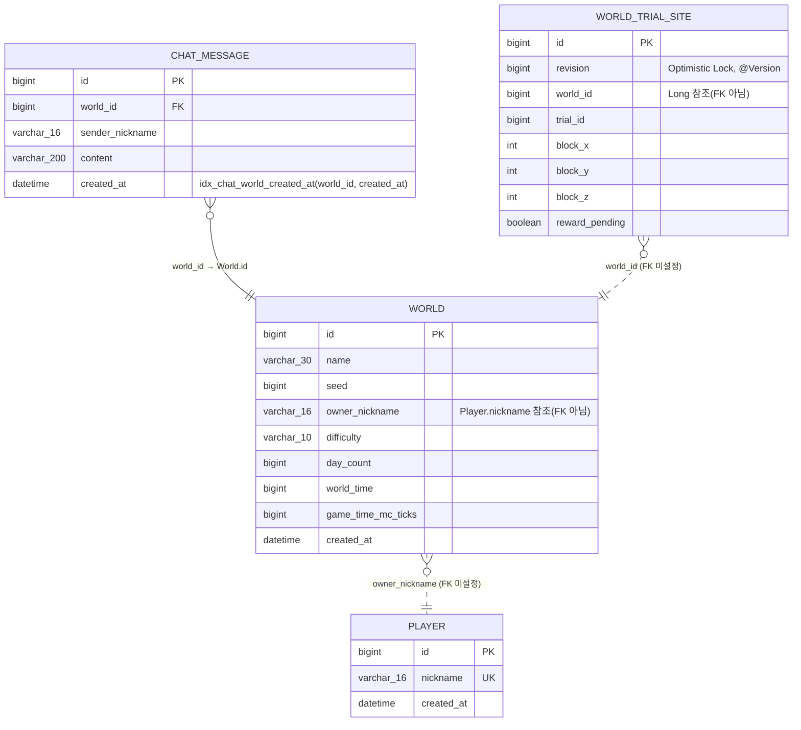

# WebCraft — Spring Boot 실시간 멀티플레이어 게임 서버

> 내일배움캠프 게임서버 백엔드 부트캠프 **Spring 심화(expert) 과제** 제출용 프로젝트입니다.
>
> 원본 프로젝트인 [f-api/game-spring-expert-assignment](https://github.com/f-api/game-spring-expert-assignment)를 포크하여, 뼈대만 있던 실시간 멀티플레이어 서버를 REST API + WebSocket + Redis(Presence/Cache/RateLimit) + MySQL(Docker)로 구현했습니다.
>
> 본 README는 **배포를 목적으로 작성된 문서가 아니며**, 과제 제출 및 튜터 평가를 위해 구현 내용과 설계 의도를 정리한 문서입니다.

- API 명세: https://f-api.github.io/game-spring-api-docs/expert/api-docs.html

## 과제 개요

| 항목 | 내용 |
|---|---|
| 과정 | 내일배움캠프 게임서버 백엔드 부트캠프 |
| 과제 | Spring 심화 — WebCraft 실시간 멀티플레이어 서버 구현 |
| 제출 목적 | 과제 제출 및 튜터 코드 리뷰/평가 |
| 원본 저장소 | [f-api/game-spring-expert-assignment](https://github.com/f-api/game-spring-expert-assignment) (Fork) |
| 다루는 범위 | 플레이어/월드 REST API, WebSocket 실시간 통신(ping/pong, chat, move, onlineUsers), Redis 기반 접속 상태·캐시·Rate Limit, JPA 낙관적 락, 커서 기반 페이지네이션 |

## 기술 스택

| 구분 | 내용 |
|---|---|
| Language / Framework | Java 21, Spring Boot 4.1 |
| 실시간 통신 | Spring WebSocket |
| Data Access | Spring Data JPA (Hibernate) |
| Database | MySQL 8.4 (Docker) |
| Cache / 상태 저장 | Redis 7 (Docker) — Presence(ZSet), 최근 채팅 캐시, Lua 기반 Rate Limit |
| Build Tool | Gradle |
| Test | JUnit5, MockMvc, Testcontainers |

## 로컬 실행 방법

1. Docker Compose로 MySQL, Redis 실행

    ```bash
    docker compose up -d
    ```

    `docker-compose.yaml`에 정의된 컨테이너는 다음과 같습니다.

    | 서비스 | 이미지 | 포트 | 접속 정보 |
    |---|---|---|---|
    | mysql | `mysql:8.4` | 3306 | DB `game`, root / `1234` |
    | redis | `redis:7` | 6379 | - |

2. `src/main/resources/application.properties` 확인 (기본값 그대로 사용 가능)

    ```properties
    spring.datasource.url=jdbc:mysql://localhost:3306/game
    spring.datasource.username=root
    spring.datasource.password=1234
    spring.jpa.hibernate.ddl-auto=update
    ```

3. 서버 실행

    ```bash
    ./gradlew bootRun
    ```

4. 브라우저 접속 `http://localhost:8080`

## 아키텍처 / 설계 원칙

- **레이어 분리**: REST는 Controller / Service / Repository, 실시간 통신은 `WsMessageHandler` 구현체(`PingWsHandler`, `MoveWsHandler`, `ChatWsHandler`, `OnlineUsersWsHandler`)와 `MessageRouter`로 역할을 분리했습니다.
- **단방향 연관관계만 사용**: `ChatMessage → World`처럼 조회가 필요한 방향으로만 `@ManyToOne`을 걸었고, `World`, `WorldTrialSite`는 서로를 참조하지 않습니다. `World`를 삭제해도 자식 레코드가 함께 지워지도록 cascade에 의존하지 않고, 필요한 조회·정합성 로직은 Service 레이어에서 명시적으로 처리합니다.
- **DB(MySQL)와 캐시(Redis)의 책임 분리**: 플레이어·월드·채팅 원본은 MySQL에 영속화하고, Redis는 (1) 월드 접속자 Presence(ZSet + TTL), (2) 최근 채팅 조회 캐시(TTL 5초), (3) 채팅 전송 횟수 제한(Lua 원자 연산)처럼 "휘발되어도 되는 상태"만 담당하도록 나눴습니다.
- **동시성 제어**: 월드 생성 상한(3개) 검사는 `WorldOperations.duringCreation(...)` 잠금 안에서 개수 확인과 저장을 함께 수행해 레이스 컨디션을 막고, `WorldTrialSite`는 `@Version`을 이용한 JPA 낙관적 락으로 동시 갱신 시 충돌을 감지합니다. 채팅 전송 제한은 GET → INCR → EXPIRE로 나뉘어 있던 로직을 Redis Lua 스크립트로 원자화했습니다.
- **API 명세 100% 준수**: 경로, JSON 필드명, WebSocket 메시지 타입/종료 코드를 명세와 정확히 일치시켰습니다.

## ERD

`World`는 채팅 메시지와 트라이얼 사이트를 소유하는 루트 엔티티이며, 화살표는 FK를 보유한(참조하는) 쪽에서 참조 대상 쪽으로 그렸습니다. `Player`는 `nickname` 문자열로만 참조되고 실제 FK 관계는 없습니다.



## 실시간 통신 개요 (WebSocket)

```
ws://localhost:8080/ws/worlds/{worldId}?nickname=steve
```

`NicknameHandshakeInterceptor`가 핸드셰이크 단계에서 `nickname`·`worldId`를 조회해 연결 attribute로 저장하고, 실패 시 종료 코드(`4000` 닉네임 없음, `4001` 월드 없음, `4002` 중복 접속)로 연결을 끊습니다. 연결 이후에는 `MessageRouter`가 `type` 필드로 아래 핸들러에 메시지를 라우팅합니다.

| type | 방향 | 처리 |
|---|---|---|
| `ping` | 클라 → 서버 | `PresenceService.heartbeat()`로 Redis Presence TTL 갱신 후 `pong` 응답 |
| `chat` | 클라 → 서버 | Rate Limit(Lua) 통과 시 `ChatService`로 저장하고 같은 월드 전체에 `chat` 브로드캐스트 |
| `move` | 클라 → 서버 | 이동/시선/상태 값을 `PlayerAction.Move`로 변환해 게임 엔진에 전달 |
| `onlineUsers` | 클라 → 서버 | 현재 서버에 열려 있는 같은 월드 연결의 닉네임을 정렬해 요청자에게만 응답 |

## 구현 내용 (레벨별 PR)

| 레벨 | 내용 | PR |
|---|---|---|
| Lv1 | Docker로 MySQL과 Redis 설정 | [#1](https://github.com/Eunseok/game-spring-expert-assignment/pull/1) |
| Lv2 | SQL을 JPA 인덱스로 표현하기 — `chat_messages` 복합 인덱스 | [#2](https://github.com/Eunseok/game-spring-expert-assignment/pull/2) |
| Lv3 | 요청 검증과 DTO — 플레이어 등록 | [#4](https://github.com/Eunseok/game-spring-expert-assignment/pull/4) |
| Lv4 | 월드 생성과 동시성 제어(최대 3개 상한) | [#5](https://github.com/Eunseok/game-spring-expert-assignment/pull/5) |
| Lv5 | 채팅 저장과 내역 조회 로직 | [#6](https://github.com/Eunseok/game-spring-expert-assignment/pull/6) |
| Lv6 | 최근 채팅 조회 API 구현 | [#7](https://github.com/Eunseok/game-spring-expert-assignment/pull/7) |
| Lv7 | WebSocket 연결과 사용자 식별(핸드셰이크) | [#8](https://github.com/Eunseok/game-spring-expert-assignment/pull/8) |
| Lv8 | WebSocket 핸들러에 닉네임 인터셉터 등록 | [#10](https://github.com/Eunseok/game-spring-expert-assignment/pull/10) |
| Lv9 | 월드별 WebSocket 세션 관리 | [#9](https://github.com/Eunseok/game-spring-expert-assignment/pull/9) |
| Lv10 | Redis 접속 상태(Presence) 관리 — ZSet | [#11](https://github.com/Eunseok/game-spring-expert-assignment/pull/11) |
| Lv11 | 메시지 라우팅과 Ping/Pong | [#12](https://github.com/Eunseok/game-spring-expert-assignment/pull/12) |
| Lv12 | 플레이어 이동 요청 처리 | [#13](https://github.com/Eunseok/game-spring-expert-assignment/pull/13) |
| Lv13 | 채팅 요청 처리와 응답 구성 | [#14](https://github.com/Eunseok/game-spring-expert-assignment/pull/14) |
| Lv14 | 같은 월드의 참여자에게 채팅 전송(브로드캐스트) | [#15](https://github.com/Eunseok/game-spring-expert-assignment/pull/15) |
| Lv15 | 접속자 목록 조회 | [#16](https://github.com/Eunseok/game-spring-expert-assignment/pull/16) |
| Lv16 | 낙관적 락 — `WorldTrialSite`에 `@Version` 적용 | [#17](https://github.com/Eunseok/game-spring-expert-assignment/pull/17) |
| Lv17 | 커서 기반 페이지 조회 — 과거 채팅 내역 | [#18](https://github.com/Eunseok/game-spring-expert-assignment/pull/18) |
| Lv18 | Redis 최근 채팅 캐시(TTL) | [#19](https://github.com/Eunseok/game-spring-expert-assignment/pull/19) |
| Lv19 | Redis Lua로 채팅 전송 횟수 제한(원자적 처리) | [#20](https://github.com/Eunseok/game-spring-expert-assignment/pull/20) |

> 각 레벨의 상세한 구현 과정과 검증 내용은 위 PR을 참고해 주세요.

## 트러블슈팅 하이라이트

- **`chat_messages` 인덱스 누락으로 부팅 실패**: `ChatHistoryIndexRequirement`가 부팅 시 `idx_chat_world_created_at(world_id, created_at)` 인덱스 존재를 검증하는데, 엔티티의 `@Table`에 인덱스 정의가 없어 JPA가 인덱스를 생성하지 않아 `CHAT_HISTORY_INDEX_MISSING` 예외로 부팅이 실패했습니다. `@Index`를 추가해 해결했습니다. ([#2](https://github.com/Eunseok/game-spring-expert-assignment/pull/2))
- **채팅 전송 횟수 제한의 동시성 문제**: 기존 구현은 Redis에서 GET(횟수 확인) → INCR(증가) → EXPIRE(만료 설정) 3단계를 애플리케이션에서 나눠 호출해, 동시 요청 시 제한 횟수를 초과해서 통과시킬 수 있는 race condition이 있었습니다. 세 연산을 하나의 Redis Lua 스크립트로 묶어 원자적으로 실행하도록 변경해 해결했습니다. ([#20](https://github.com/Eunseok/game-spring-expert-assignment/pull/20))